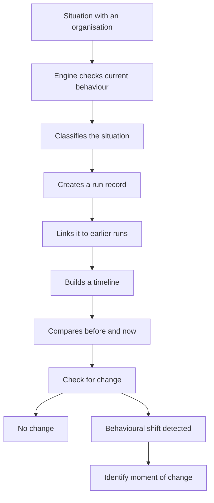

# Civic Decision Engine (CDE)

A framework for tracking how institutional behaviour changes over time — clearly, consistently, and without guesswork.

---

## What this is (in simple terms)

The Civic Decision Engine is a way of keeping track of how situations change over time.

Imagine you have a problem with an organisation.

At the start, they might respond normally.  
Then they slow down.  
Then they only partly engage.  
And eventually, they might stop responding altogether.

The engine looks at that and answers a simple question:

**“What stage is this at right now?”**

But more importantly, it keeps a record of each check.

So instead of just seeing one moment, it shows:

- what it looked like before  
- what it looks like now  
- whether anything actually changed  

And this is the key part:

It can tell the difference between:

- **something new happened**
- **nothing changed, but we checked again**

That matters, because sometimes things feel like they’re moving, but they’re actually just staying the same.

It also identifies the moment things shift — for example, the exact point where something moves from *Partial engagement* to *Resistance*.

---

## What it does

The engine:

- Classifies behaviour at a given moment  
  *(e.g. Response, Delayed response, Partial engagement, Resistance)*  
- Records each run as part of a sequence  
- Tracks whether anything actually changed between runs  
- Detects the first moment behaviour shifts  

---

## Development Status

v10 establishes:

- Run comparison logic  
- Lineage continuity tracking  
- Transition state detection  
- Moment-of-change identification  
- Timeline generation across runs  

The system now produces a consistent record of behavioural progression over time.

---

## Extended Capabilities

- Run comparison to distinguish change vs repeated observation  
- Lineage tracking with continuity validation  
- Transition state detection between behavioural classifications  
- Moment-of-change identification (first detected shift)  
- Timeline generation across runs   

---

## Key Concepts

**Run**  
A single observation of a case at a point in time.

**Lineage**  
Each run is linked to the previous one, forming a chain.

**Depth**  
Indicates how far along the sequence the record has progressed.

**Behaviour vs Metadata**  
The engine distinguishes between:
- a new observation being recorded  
- an actual behavioural change  

**Moment of Change**  
The first point where behaviour shifts (e.g. Partial engagement → Resistance).
---

## How the Engine Works



## Example Output

```text
Lineage
-------
Depth Change       : 1 -> 2
Lineage Continuity : yes

Summary
-------
Behavioural change : no
Interpretation     : new run recorded, but no result-level change detected.
```

## Usage

### Run a civic analysis

```bash
python civic_decision_engine_v10.py --mode civic --export outputs/run.json
```
### Run a comparison
```bash
python civic_decision_engine_v10.py \
  --mode compare \
  --input outputs/run_2.json \
  --compare-with outputs/run_1.json \
  --timeline audit_logs/civic_engine_audit_log.json
```
## Philosophy

The engine does not attempt to solve problems.

It creates a clear, structured record of what is happening.

Once the record is clear, repetition is no longer required.

## Next Step

The Civic Decision Engine will be developed into a web application so that anyone can use it to track and understand institutional behaviour over time.

## This version is:

- Clear for non-technical readers  
- Structured for developers
