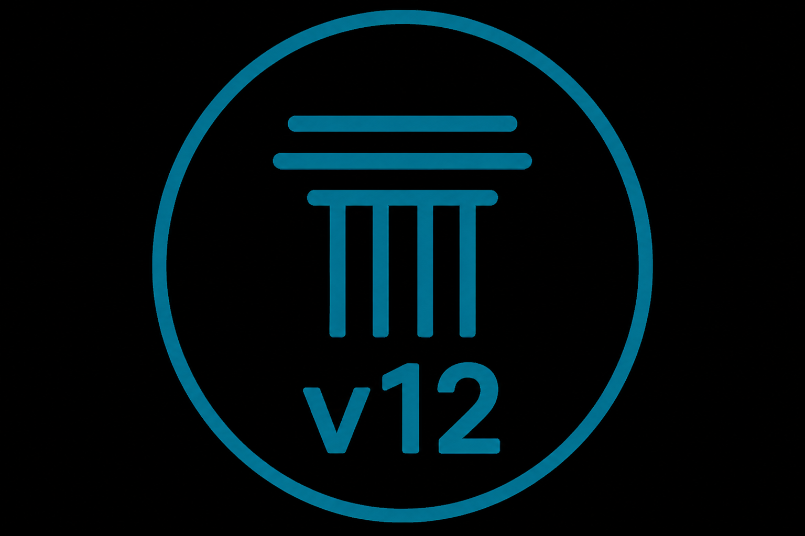

# Civic Decision Engine (CDE)
[](https://doi.org/10.5281/zenodo.21033426)
[](https://osf.io/wz29x/)
[](https://github.com/nickdebrief/civic-decision-engine)



An open, deterministic framework for evaluating visible civic records and record-derived administrative outputs through inspectable evidence relationships, dependency mappings, pathway stability analysis, and reproducible report generation.

---

## Key Capabilities
- Structured civic record evaluation
- Evidence relationship mapping
- Administrative dependency mapping
- Pathway stability analysis
- Reproducible report generation
- Public verification and citation export

---

## Design Principles

- Deterministic evaluation
- Explicit methodological limitations
- Inspectable evidence relationships
- Reproducible outputs
- Versioned and citable artefacts
- Public verification and transparency

---

## Research Artefacts
- DOI: https://doi.org/10.5281/zenodo.21033426
- OSF Project: [Open Science Framework (OSF)](https://osf.io/wz29x/)
- GitHub Repository: https://github.com/nickdebrief/civic-decision-engine

---

A public civic record and verification system for structured institutional analysis.

Observation sometimes becomes clearer when structure is applied.

Not designed for attention.  
Designed for understanding.

---

Current release: v13.0.4

Release documentation:
- [`docs/releases/CDE_V13_0_4_RESTORE_TWO_COLUMN_LANDING_PAGE_FOOTER_LAYOUT.md`](docs/releases/CDE_V13_0_4_RESTORE_TWO_COLUMN_LANDING_PAGE_FOOTER_LAYOUT.md)
- [`docs/releases/CDE_V13_0_3_LANDING_PAGE_FOOTER_CONTAINER_CORRECTION.md`](docs/releases/CDE_V13_0_3_LANDING_PAGE_FOOTER_CONTAINER_CORRECTION.md)
- [`docs/releases/CDE_V13_0_2_LANDING_PAGE_FOOTER_ALIGNMENT.md`](docs/releases/CDE_V13_0_2_LANDING_PAGE_FOOTER_ALIGNMENT.md)
- [`docs/releases/CDE_V13_0_1_PUBLIC_TRANSMISSION_UX_REFINEMENTS.md`](docs/releases/CDE_V13_0_1_PUBLIC_TRANSMISSION_UX_REFINEMENTS.md)
- [`docs/releases/CDE_V13_0_GOVERNED_PUBLIC_TRANSMISSIONS.md`](docs/releases/CDE_V13_0_GOVERNED_PUBLIC_TRANSMISSIONS.md)
- [`docs/releases/CDE_V13_A_PLATFORM_IDENTITY_TRANSITION.md`](docs/releases/CDE_V13_A_PLATFORM_IDENTITY_TRANSITION.md)
- [`docs/releases/README_v12.md`](docs/releases/README_v12.md)

---

## Live System

https://civic-decision-engine-production.up.railway.app/

---

## What this is

The Civic Decision Engine is a diagnostic system for analysing institutional behaviour through structured civic records.

It does not argue a case.  
It classifies and interprets institutional behaviour based on structured inputs.

The system is designed to make institutional progression visible through:
- conditions
- trajectories
- transitions
- structural continuation

---

## What v12 introduces

Version 12 introduces additive attachment infrastructure for referenced evidence
artifacts while preserving canonical record verification hashes and canonical
serialization.

New capabilities include:

- Additive attachment infrastructure for referenced evidence artifacts
- Independent SHA-256 hashing for attachment content
- Attachment metadata projection through public record manifests
- Optional source-document date metadata
- Privacy filtering for private, withheld, and deleted attachments
- Admin-only upload infrastructure protected by `CDE_ADMIN_TOKEN`
- Local read-only attachment inspection tooling
- Controlled production verification using synthetic test artifacts
- Preservation of canonical record verification hashes and canonical serialization

Attachments are additive and non-canonical. They do not replace canonical
records, alter verification hashes, or change public record creation behavior.

v12 does not include public attachment downloads, public attachment serving,
attachment search, OCR, PDF text extraction, semantic indexing of attachment
content, or a public upload UI.

---

## CDE v12.2 — Admin Document Intake

CDE v12.2 extends the existing authenticated administration interface with a
private PDF intake workflow. Administrators can capture document metadata,
store the original PDF in a pending intake area, inspect its SHA-256 hash and
proposed private storage location, and review pending submissions.

Pending intake is deliberately separate from public records and record
attachments. Uploading a document does not create or modify a record, publish
an attachment, establish an evidence relationship, or change canonical or
attachment hashes. Approval, publication, and record creation remain deferred
to a later stage.

### CDE v12.3 — Admin Approval Workflow

CDE v12.3 adds an explicit private lifecycle to document intake: **Pending
Intake**, **Under Review**, **Approved**, **Published**, **Rejected**, and
**Archived**. Authenticated administrators can begin review, approve or reject,
archive, update internal notes, and inspect timestamped transition history.

Transitions are constrained by the declared lifecycle and invalid transitions
are rejected without changing metadata. Approval does not publish a document.
In v12.3, Published is a declared administrative status only; it creates no
public route, public attachment, evidence relationship, or public-record
mutation. Actual public exposure remains deferred.

### CDE v12.4 — Public Document Library

CDE v12.4 activates controlled public visibility for documents whose current
administrative lifecycle state is exactly **Published**. The public library at
`/documents` supports search by title, institution, category, and reference
identifier, plus institution, category, and publication-year filters. Each
published document has a metadata/provenance page and governed PDF download.

Pending Intake, Under Review, Approved, Rejected, and Archived documents remain
private and return no public detail or download. Public eligibility is checked
from the current lifecycle state on every request. Publication changes no CREF
methodology, record verification hash, evidence relationship, evaluation,
classification, or public record.

### CDE v12.5 — Admin Navigation Console

CDE v12.5 organises the existing authenticated admin area into one coherent
Administration Console at `/admin`. A shared navigation bar connects the
dashboard, new document intake, intake management/review, record evidence, and
the Public Document Library. The dashboard also provides lifecycle counts,
active review-queue links, record-reference navigation, and the existing
session logout action.

This stage changes navigation and presentation only. Admin pages retain the
existing signed-session boundary, the public library remains public, and no
private intake metadata is added to public pages. Lifecycle transitions,
publication eligibility, evidence relationships, classifications, hashes, and
record behavior are unchanged.

### CDE v12.5.1 — Complete Administration Console Navigation

CDE v12.5.1 completes the Administration Console dashboard with first-class
summary cards for Pending Intake, the active Review Queue, Record Evidence,
and the Public Document Library. Record Evidence now has a dedicated **Open Record
Evidence** card describing the existing inspection capabilities and retaining
the known-reference navigation boundary.

This maintenance stage changes dashboard navigation and presentation only. It
adds no record index, lifecycle transition, publication action, evidence
operation, hash or verification change, security change, or public API.

### CDE v12.5.2 — Public Footer Administration Link

CDE v12.5.2 adds a discreet **Administration** link beneath the existing
right-hand public footer identity, `Civic Decision Engine v12 — The record does
not argue.`, routing users to the existing authenticated `/admin` entry point.

This stage changes public footer navigation only. It does not change admin
login, session handling, authorization, document intake, lifecycle management,
publication rules, private intake visibility, evidence relationships, hashes,
verification, records, attachments, database state, or public API behaviour.

### CDE v12.5.3 — Footer Administration Link UI Fix

CDE v12.5.3 refines the public footer Administration link so it visually
matches the existing footer links, opens `/admin` in a new tab, and routes
unauthenticated browser users to the existing admin login UI instead of an
API-style JSON unauthorized response.

This corrective stage preserves the existing authentication and authorization
boundary. Authenticated administrators continue to reach the CDE Administration
Console, while the public footer exposes no private records, intake data,
lifecycle state, evidence, administrative counts, or security state.

### CDE v12.5.4 — Admin Login Redirect Fix

CDE v12.5.4 separates the browser login form flow from the programmatic API
login response. The admin login page now posts to a browser-facing login route
that sets the existing signed admin session cookie and redirects to `/admin`,
so successful browser login opens the CDE Administration Console instead of
displaying raw JSON.

The existing `/api/admin/session/login` endpoint remains available for the API
contract and continues to return the established JSON response with the same
secure session cookie behaviour. Authentication, authorization, private intake
visibility, lifecycle rules, publication controls, evidence relationships,
hashes, verification, database state, and public API behaviour are otherwise
unchanged.

### CDE v12.5.5 — Public Library Footer Link

CDE v12.5.5 adds **Public Library** to the shared public footer navigation,
immediately after **API docs**, linking to the existing `/documents` route.

This stage adds only a public navigation link. It does not change document
publication eligibility, `/documents` access rules, authentication,
authorization, intake lifecycle state, evidence relationships, hashes,
verification, records, attachments, database state, or public API behaviour.

### CDE v12.5.6 — Public Document Library Label Alignment

CDE v12.5.6 updates the shared public footer navigation label from **Public
Library** to **Public Document Library**, aligning the public UI with the formal
feature name while preserving the existing `/documents` route and all document
visibility, publication, authentication, authorization, evidence, hashing,
verification, database, and API behaviour.

### CDE v12.6 — Named Administrator Authentication

CDE v12.6 replaces password-only Administration Console login with named
administrator authentication using the required `ADMIN_USERNAME` and
`ADMIN_PASSWORD` environment variables. Successful authentication stores the
administrator username in the protected server-side session and uses that
identity for newly created document-intake and lifecycle-history actor
attribution. Historical actor values remain unchanged.

This stage fails closed when either credential variable is absent or empty. It
does not add default credentials or a password-only fallback, and it does not
change document lifecycle rules, approval/publication boundaries, public
visibility, evidence handling, SHA-256 verification, database behaviour,
records, attachments, classification logic, public APIs, or footer navigation.

### CDE v12.6.1 — Legacy Credential Audit and Admin Library Label Alignment

CDE v12.6.1 confirms that the legacy `CDE_ADMIN_PASSWORD` variable is no longer
referenced by active runtime code after named administrator authentication moved
to `ADMIN_USERNAME` and `ADMIN_PASSWORD`. Remaining references are audit
documentation or test assertions only, so the legacy Railway variable can be
removed from deployment configuration after operational confirmation. No
fallback to the legacy variable was introduced.

This maintenance stage also aligns active Administration Console labels with
the canonical **Public Document Library** feature name while preserving the
existing `/documents` route and all authentication, lifecycle, publication,
evidence, hashing, verification, database, API, footer-navigation, and
public/private visibility behaviour.

### CDE v12.7 — Administrative Identity

CDE v12.7 makes the authenticated administrator identity visible inside the
Administration Console through a restrained session-derived indicator such as
`Signed in as: <username>`. The displayed identity comes only from the signed
administrator session created by the `ADMIN_USERNAME` and `ADMIN_PASSWORD`
login flow; it is not read from query parameters, form fields, headers, or
client-supplied actor values.

This stage also improves readability of the active document lifecycle-history
Actor column so ordinary values such as historical `admin` entries and newer
named administrator entries remain readable while long identifiers can still
wrap safely. Historical actor values are preserved exactly as recorded, and
new lifecycle attribution continues to come only from the authenticated
server-side session. No authentication, lifecycle, publication, evidence,
hashing, verification, database, API, Public Document Library, public-footer,
or public/private visibility behaviour changes are introduced.

### CDE v12.8 — Image Document Intake

CDE v12.8 extends the authenticated Admin Document Intake workflow to accept
PDF, JPEG, and PNG document records through the same controlled lifecycle:
Pending Intake, Under Review, Approved, Published, Rejected, and Archived.
File type is validated server-side using both the filename extension and
uploaded byte signature, and the detected document type is stored as
server-derived metadata.

Uploaded bytes are preserved exactly. The SHA-256 digest continues to identify
the original uploaded file, and image records remain private until an
authenticated administrator explicitly marks them Published. Published JPEG
and PNG records appear in the existing Public Document Library, use the same
search and filter behaviour as PDFs, display a restrained inline image on the
public detail page, and serve the original bytes with the correct media type.

This stage does not add bulk upload, OCR, image interpretation, automatic
metadata extraction, image conversion, thumbnailing, galleries, Strike-specific
fields, lifecycle changes, authentication changes, database schema changes,
evidence changes, verification changes, or audit-table redesign.

### CDE v12.8.1 — Public Image Presentation Refinement

CDE v12.8.1 separates public image viewing from original-image downloading for
published JPEG and PNG records. Public image detail pages now use a dedicated
inline image-view route for browser display while preserving the existing
download route for explicit original-file download. Both routes return the
exact preserved bytes, use server-derived media types, and remain restricted to
Published image records.

This refinement also improves the Document Intake Review lifecycle-history
table with a responsive wrapper and semantic column styling for timestamp,
previous status, new status, actor, and note values. Ordinary lifecycle labels
remain readable without changing lifecycle data, actor attribution, notes,
authentication, storage, provenance, evidence, verification, database behaviour,
PDF downloads, footer navigation, or public/private visibility boundaries.

### CDE v12.9 — Administrative Audit Traceability

CDE v12.9 adds an authenticated Administrative Audit page at `/admin/audit`.
The page consolidates existing Document Intake lifecycle-history entries into a
read-only traceability table showing timestamp, affected document, reference
identifier, filename, previous status, new status, actor, transition note,
current document status, and a link back to the existing review page.

The audit view reads from the authoritative stored lifecycle history already
held with intake records. It adds conservative server-side filtering,
deterministic newest-first ordering, bounded pagination, responsive table
presentation, and shared signed-in administrator identity display without
creating new lifecycle states, rewriting historical actors, exposing storage
paths, adding mutation controls, or changing document intake, publication,
Public Document Library, evidence, verification, hashing, database, footer, or
public/private visibility behaviour.

### CDE v12.10 — Publication Provenance Expansion

CDE v12.10 expands the public document detail page with structured Publication
Provenance and Publication Pathway sections for Published documents. The public
page now presents the intake timestamp, server-detected format, original
filename, file size, SHA-256 digest, recorded lifecycle actors, review, approval
and publication timestamps, current lifecycle state, public reference identifier,
presentation mode, and original-file download availability.

The provenance layer is derived from existing document metadata and stored
Document Intake lifecycle history. It preserves historical actor values, uses the
earliest stored transition into Published as the displayed publication timestamp,
keeps PDF/JPEG/PNG view and download behaviour unchanged, and explains that
SHA-256 identifies exact admitted bytes without certifying authorship, factual
truth, legal status, or external authenticity. No lifecycle, publication,
storage, hashing, Administrative Audit, Public Document Library search/filter,
evidence, database, footer, or public/private visibility behaviour changes are
introduced.

### CDE v12.11 — Public Record–Document Association

CDE v12.11 introduces a governed association layer between the Public Record
Index and the Public Document Library. Authenticated administrators can create,
inspect, update, deactivate, and reactivate explicit relationships between an
existing public CDE record and an existing Published document. Associations are
separate governed objects with their own identity, relationship type, public
label, public/private visibility, active state, administrative note, public note,
actor attribution, timestamps, and immutable association history.

Public record pages now show active, public, eligible associated documents, and
public document pages show active, public, eligible associated civic records. The
association does not make a document part of a record's evidence, does not alter
record verification hashes, does not change document lifecycle or SHA-256 values,
and does not imply evidential sufficiency, factual verification, legal status,
authorship, responsibility, or endorsement.

### CDE v12.12 — Association Governance and Public Traceability

CDE v12.12 adds stable public association references and a public traceability
page for eligible record-document associations. Association references use the
format `CDE-ASSOC-YYYYMMDD-NNN`; existing associations are backfilled
idempotently without changing their original creation metadata or stored
association history.

Public association pages at `/associations/{association_reference}` show the
association summary, linked public record, linked Published document, governance
boundary, and a public-safe Association Pathway derived from authoritative
association-history entries. Public record and document pages now retain their
direct linked-object actions and add a `View association` link when the
association is active, public, and both linked objects remain publicly eligible.
The stage does not change record verification hashes, document SHA-256 values,
document lifecycle, Publication Provenance, Administrative Audit, search,
filters, publication eligibility, or public/private visibility boundaries.

### CDE v12.13 — Public Association Index and Discovery

CDE v12.13 expands association traceability with a public discovery index at
`/associations`. The page lists only active, public, dynamically eligible
record-document associations with stable public association references, public
relationship labels, linked civic-record context, linked Published-document
context, and separate actions for the association, record, and document.

The public index adds public-safe search, filters, deterministic ordering,
bounded pagination, count summaries, responsive result presentation, and clear
non-evidential boundary wording. It does not create, infer, validate, rank,
mutate, or expose associations beyond the existing v12.12 eligibility rules,
and it does not change record verification, document lifecycle, SHA-256 values,
Publication Provenance, Administrative Audit, Public Record Index behaviour,
Public Document Library behaviour, image/PDF behaviour, authentication, footer
navigation, or public/private visibility boundaries.

### CDE v12.14 — Governed Archive Collections

CDE v12.14 introduces first-class governed Archive Collection objects with
stable public references using the format `CDE-COLL-YYYYMMDD-NNN`.
Authenticated administrators can create, update, deactivate, reactivate, and
inspect collection identities and immutable collection history through the
Administration Console.

Public collection pages at `/collections/{collection_reference}` and the public
index at `/collections` expose only active, public collections. Collections
provide governed context for independently preserved documents, but CDE v12.14
does not implement document membership, sequence positions, previous/next
navigation, automatic grouping, document copying, or changes to document
provenance, lifecycle, SHA-256 values, record verification, associations,
Publication Provenance, Administrative Audit, Public Record Index, Public
Document Library, authentication, footer navigation, or public/private
visibility rules.

### CDE v12.15 — Governed Intake Correction and Document Reassignment

CDE v12.15 introduces a governed correction path for archived Document Intake
records whose exact preserved document bytes were assigned to incorrect
metadata. Authenticated administrators can create an Intake Correction, review
it, authorise it, and execute it through the controlled lifecycle:
Draft, Under Review, Reviewed, Authorised, and Completed.

Completion creates a new corrected intake identity from the exact same
preserved bytes and SHA-256 digest while leaving the archived source intake and
its history unchanged. The destination intake begins as ordinary Pending Intake
and must still pass through the existing review, approval, and publication
workflow. Ordinary duplicate detection remains unchanged, client-supplied actor
or reference overrides are not accepted, and no record, document lifecycle,
publication, provenance, evidence, hash, storage, database, Public Document
Library, Public Record Index, association, collection, footer, or
public/private visibility behaviour is changed beyond the correction workflow
and related administrative presentation.

### CDE v12.16 — Administration Console Navigation and Governance Table Readability

CDE v12.16 refines the authenticated Administration Console as a navigation and
readability stage. The dashboard now presents Document Intake and Intake
Corrections as first-class administrative destinations alongside Pending
Intake, Review Queue, Administrative Audit, Associations, Archive Collections,
Record Evidence, and the Public Document Library.

Wide authenticated governance tables now use shared responsive wrappers and
semantic column classes so intake, correction, audit, and collection records
remain readable on desktop while preserving horizontal scrolling on narrower
screens. The stage changes presentation only. It does not alter authentication,
session handling, actor attribution, lifecycle rules, correction execution,
publication behaviour, evidence, hashing, storage, database schema, public
routes, or public/private visibility boundaries.

### CDE v12.17 — Collection Membership Governance

CDE v12.17 introduces governed Archive Collection Memberships as independent
objects with immutable `CDE-MEM-YYYYMMDD-NNN` references. Authenticated
administrators can create, review, approve, activate, remove, restore, and
sequence memberships that reference existing document-intake records without
copying documents or changing document identity, lifecycle, publication,
provenance, SHA-256 values, evidence, verification, or public eligibility.

Archive Collection detail pages now include a Collection Members section and
membership detail/history views. Public collection pages render only active,
publicly eligible governed member documents ordered by membership
`display_sequence`, linking to the existing Public Document Library detail page
for each document. The collection presents governed memberships, not document
copies, and the stage does not alter archive collection identity, document
intake, corrections, record-document associations, Publication Provenance,
Administrative Audit, Public Record Index, Public Document Library behaviour,
authentication, footer navigation, or public/private visibility boundaries.

### CDE v12.18 — Ordered Sequence and Continuity

CDE v12.18 makes governed collection membership sequence operationally
inspectable. The existing membership `display_sequence` remains the source of
truth, with deterministic ordering by sequence, creation timestamp, and
membership reference. Archive Collection detail pages now show Collection
Sequence diagnostics, continuity state, active member count, sequence range,
missing or duplicate positions, and previous/next membership context.

Sequence changes are explicit governed membership actions requiring an
administrative note and signed-session actor attribution. Active memberships
must use positive sequence positions and duplicate active positions within a
collection are rejected. Public collection pages project only public-eligible
members into safe member numbering and previous/next document navigation,
without revealing hidden memberships or administrative gaps. The stage does not
alter document identity, lifecycle, publication, provenance, SHA-256 values,
record associations, collection identity, membership identity, evidence,
verification, authentication, or public/private visibility boundaries.

### CDE v12.19 — Governed Record Selection for Record–Document Associations

CDE v12.19 replaces free-text record entry in the authenticated
Record–Document Association creation workflow with a governed selector
populated from existing public CDE records. The form now distinguishes the
Public CDE record, Published document, and Association reference, submitting
only the exact canonical stored record reference while keeping readable labels
as presentation text.

Server-side validation remains authoritative. Crafted submissions must contain
exactly one public record reference, reject multiple-reference syntax, reject
display labels or prefixes, and reject document references submitted as record
references. The stage preserves existing association semantics, actor
attribution, relationship types, duplicate-association behaviour, public/private
visibility rules, record verification hashes, document SHA-256 values,
document lifecycle, evidence handling, archive collections, collection
membership sequence, Public Record Index behaviour, and Public Document Library
behaviour.

### CDE v12.20 — Searchable and Readable Record Selection

CDE v12.20 improves the governed Record–Document Association creation
workflow by making the public-record selector searchable and easier to read.
The form now uses compact canonical-reference-first option labels, an explicit
empty placeholder, a client-side search field, safe public search metadata, and
a selected-record context panel showing public record reference, institution
code, trajectory, system state, finding summary, and public record link.

The selector remains progressively enhanced: JavaScript improves filtering and
context display, but ordinary form submission still uses the original
`record_reference` select field. Backend validation from v12.19 remains
authoritative, and search text, display labels, metadata attributes, and
context-panel content are never stored as association values. No schema,
eligibility, association lifecycle, record lifecycle, document lifecycle,
evidence, publication, provenance, verification hash, SHA-256, archive
collection, membership, authentication, public/private visibility, footer,
search, filtering, or pagination behaviour is changed.

### CDE v12.21 — Public Collection Pages

CDE v12.21 expands governed Archive Collection public presentation so published
collections can present ordered memberships across independently governed public
objects: Canonical Records, Published Documents, and governed Record–Document
Associations. Public routes remain `/collections` and
`/collections/{collection_reference}`.

Collection membership remains its own governed object with immutable membership
history and sequence. Existing document memberships remain backward compatible,
while new typed member references let each visible item link to its own
independent public page. Public rendering dynamically omits unavailable members
without deleting memberships or rewriting history, and no document bytes,
SHA-256 values, record verification hashes, lifecycle states, publication rules,
association semantics, evidence, Administrative Audit, or public/private
visibility boundaries are changed.

### Canonical Record Types

The canonical record model now supports a governed `record_type` field so CDE
records can represent distinct civic and administrative events, including
Strike, Complaint, Investigation, Decision, Proceeding, Administrative Action,
Public Submission, Policy Event, and Research Record. Existing records without
an explicit type continue to behave as Strike records without changing their
references, URLs, lifecycle state, verification hashes, associations, or
history.

Record type is stored as a stable machine value and displayed with a public
label on public record and verification views. It is searchable in the Public
Record Index and included in governed Record–Document Association selection so
published documents can be attached to the correct canonical record type, such
as a Complaint record, without using an unrelated Strike record. Record type is
not added to legacy verification-hash inputs; existing hashes remain
verifiable.

### Create Canonical Record from Published Document

Administrators can now use an existing Published document as source context for
creating a distinct canonical CDE record. The Published document admin view
offers a governed **Create canonical record from this document** action that
prefills editable record metadata from the document title, description,
institution/source, document date, category, Keywords, and reference identifier
where available.

The workflow preserves object boundaries: the document remains a published
evidential artefact, the record is created as a separate canonical public
record, and any Record-Document Association is created only when explicitly
confirmed. The document SHA-256 is not reused as the record verification hash,
document bytes are not copied into the record, OCR/body text is not converted
into findings, and associations continue to pass the existing Published-only
document and public-record validation rules.

### Governed Document Keywords

Admin Document Intake now includes a governed **KEYWORDS** field for
comma-separated descriptive discovery metadata. Keywords are normalized into a
stable keyword set, preserved through review, approval, publication, governed
correction, and archival workflows, and displayed on Published document detail
pages when present.

Keywords are included in the existing `build_document_search_text()` path used
by the Public Document Library and the Published Document selector in
Record-Document Association creation. They improve discovery without changing
document bytes, SHA-256, lifecycle status, publication rules, associations,
record Conditions, record Signals, evidence, verification, or public/private
visibility boundaries.

### Governed Audio Artefact Support

Admin Document Intake now accepts original M4A, MP3, and WAV audio files
alongside PDF, JPEG, and PNG. Audio artefacts use the same private intake,
review, approval, publication, provenance, lifecycle history, SHA-256, Keywords,
and Public Document Library search paths as existing published files.

Published audio detail pages provide governed metadata, publication provenance,
an HTML5 audio player using the original published file, and an original-file
download. Audio support does not introduce transcription, speech recognition,
waveform extraction, transcoding, automatic associations, automatic canonical
records, or changes to record verification hashes. The email that refers to an
audio file and the audio artefact itself remain independently governed objects.

### CDE v12.22 — Governed Spreadsheet Artefact Support

Admin Document Intake now accepts original XLS and XLSX spreadsheet workbooks
alongside PDF, JPEG, PNG, M4A, MP3, and WAV. Spreadsheet artefacts use the same
private intake, review, approval, publication, provenance, lifecycle history,
SHA-256, Keywords, and Public Document Library search paths as existing
published files.

Published spreadsheet detail pages identify the artefact as a spreadsheet,
display available workbook metadata such as worksheet names, and retain an
original-file download with attachment behaviour. CDE validates workbook
structure server-side, rejects macro-enabled, encrypted, malformed, unsafe, or
mismatched spreadsheet packages, and never executes formulas, macros, external
links, data connections, scripts, or remote resources.

### CDE v12.23 — Public Archive Explorer

CDE v12.23 adds `/archive`, a unified public discovery doorway across existing
governed public objects: Canonical Records, Published Documents,
Record-Document Associations, and Governed Public Collections. The Explorer
provides public counts, search, filters, sorting, pagination, object-type
labels, and direct links back to each governed object's own public page.

The Explorer is not a new governance object or collection. It does not duplicate
provenance, alter lifecycle state, change verification hashes, mutate
publication eligibility, expose private metadata, or replace the existing
`/records`, `/documents`, `/associations`, or `/collections` pages.

### CDE v12.24 — Public Navigation & Information Architecture

CDE v12.24 makes `/archive` discoverable through primary public navigation and
standardises public breadcrumbs, archive return links, and governed object-type
badges across Canonical Record, Published Document, Association, and Collection
pages.

The release improves public orientation and cross-object navigation without
changing governance semantics, object identity, lifecycle behaviour, publication
eligibility, provenance, verification hashes, public/private boundaries, or the
independent public routes for each governed object.

#### Architectural Position

CDE v12.24 is not a navigation release in the conventional sense. It is the
release in which the Civic Decision Engine's governance model is expressed
through a coherent public information architecture.

Previous releases established independently governed public objects with their
own identities, provenance, publication lifecycles, and public addresses.
Version 12.24 connects those public objects through consistent navigation,
breadcrumbs, governed object badges, and cross-object navigation while
preserving their independent identities and governance semantics.

The result is not a hierarchy of pages, but a navigable public governance graph.

Public information is not organised by containment. It is organised by
governance.

#### Governance Principles Reinforced

Version 12.24 reinforces the existing architectural principles of the Civic
Decision Engine:

- Identity exists before association.
- A record is not its evidence.
- Evidence is not the record.
- The relationship is governed.
- Collections do not absorb identity.
- Provenance belongs to every object.
- History should never be overwritten.

Navigation now reflects these principles rather than obscuring them.

#### CDE v12.24.1 — Navigation Completion

CDE v12.24.1 completes the navigation symmetry introduced in v12.24 by
confirming Canonical Record pages use the same public navigation, breadcrumb,
governed object badge, and safe Archive return-link model as other governed
public objects. It also adds **Public Archive Explorer** to the shared
Administration Console navigation alongside **Public Document Library**.

This is a navigation-only completion. The Administration Console manages
governance, while the Public Archive Explorer exposes governance for public
verification. No record, document, association, collection, lifecycle,
publication, provenance, identifier, search, or access-control semantics change.

### CDE v12.25 — Governed Rich Text Format Artefact Support

Admin Document Intake now accepts original Rich Text Format (`.rtf`) artefacts
alongside PDF, JPEG, PNG, M4A, MP3, WAV, XLS, and XLSX. RTF files use the same
private intake, review, approval, publication, provenance, lifecycle history,
SHA-256, Keywords, Public Document Library, and Public Archive Explorer paths as
existing published files.

Published RTF detail pages identify the artefact as Rich Text, display governed
metadata and publication provenance, and retain an original-file download with
attachment behaviour. CDE validates RTF structure server-side, recognises
`application/rtf`, `text/rtf`, and `application/x-rtf` MIME variants, rejects
renamed or inconsistent files, and does not convert, render, execute, or extract
full text from the RTF during intake or publication.

### CDE v12.26 — Public Archive UX Refinements

CDE v12.26 refines the Public Archive Explorer so public users can scan,
filter, paginate, and orient themselves more easily across Canonical Records,
Published Documents, Record-Document Associations, and Governed Public
Collections.

The Archive Explorer improves discovery without changing governance.

The release improves archive visual hierarchy, public object total cards,
human-readable active-filter summaries, filter helper text, object-specific
result actions, bounded result-card metadata, query-preserving pagination,
no-result states, responsive layouts, and accessibility markup. It does not
change public eligibility, search semantics, object identity, provenance,
lifecycle state, publication rules, associations, collection membership,
verification hashes, or existing public routes.

### CDE v12.27 — Public Traceability Map

CDE v12.27 adds `/traceability`, a public Traceability Map that shows declared
relationships between independently governed public objects.

Traceability reveals declared relationships without erasing the identity of the
governed objects involved.

The Traceability Map is a discovery interface over the public governance graph.
It is not itself a governed object.

One traceability result represents one governed Association chain:

```text
Canonical Record
        |
        | declared by
        v
Governed Association
        |
        | links to
        v
Published Document
```

Associations remain independently governed and navigable public objects.
Collections appear only as governed membership context and do not own, contain,
or absorb Records, Documents, or Associations. The route provides a visual map,
a structured accessible view, public-safe filters, unique object counts,
bounded pagination, and safe Traceability return links.

The release does not create or infer relationships, alter governance semantics,
change object identities, rewrite provenance, change lifecycle states, alter
publication rules, expose private objects, or replace any governed object's own
public page.

### CDE v12.28 — Public Document Preview Enhancements

CDE v12.28 adds compact previews to the Public Document Library so users can
recognise published artefacts before opening each detail page.

A preview helps users recognise a governed document without becoming a new
governed object.

The preview is a presentation of an existing governed document, not a new
governed artefact.

Published JPEG and PNG documents display constrained image thumbnails that link
back to the existing Published Document page. PDF, Rich Text, Spreadsheet,
Audio, and unknown media render compact fallback previews with visible media
labels and descriptive links.

The release does not generate derived thumbnails, create new artefact
identities, change SHA-256 semantics, alter lifecycle or publication rules,
change public eligibility, modify storage, change download behaviour, or replace
existing public document routes.

### CDE v13.A — Platform Identity Transition

CDE v13.A completes the platform identity transition that prepares the Civic
Decision Engine for the v13 era.

#### Architectural Position

CDE v13.A is not the implementation of Governed Public Transmissions. It is the
release in which the platform's visible identity, documentation, branding,
version references, page titles, navigation identity, watermarks, and public and
administrative presentation are aligned with the governance architecture already
established through the v12 series.

Platform identity should reflect the governance architecture without changing it.

The current platform identity is:

- canonical name: Civic Decision Engine;
- short name: CDE;
- current platform version: v13.A;
- tagline: Independent · Transparent · Traceable.

The transition preserves all existing governed objects, identifiers,
provenance, lifecycle states, publication rules, associations, collections,
traceability views, SHA-256 semantics, public eligibility, authorization,
storage, and public URLs.

v13.A prepares the Civic Decision Engine for the v13 era. It does not introduce
Governed Public Transmissions.

### CDE v13.0 — Governed Public Transmissions

CDE v13.0 introduces **Public Transmissions** as first-class governed public
objects.

Documents preserve content. Transmissions preserve context.

A Public Transmission records the public communication context in which one or
more governed public objects were communicated. It has its own reference,
metadata, lifecycle, publication state, provenance, covering communication, and
public page.

A Transmission governs communication. It does not govern the objects
communicated.

Published Documents, Canonical Records, Record-Document Associations, and
Governed Public Collections remain independently governed and independently
addressable when referenced by a Transmission. No attached object is copied,
stored inside the Transmission, converted into a Transmission, or assigned a new
SHA-256 value.

This release adds Public Transmission Library pages, administrative Transmission
Intake and Management, typed transmitted-object relationships, Archive Explorer
discovery, Traceability Map Transmission nodes, and Collection membership
support for Public Transmissions.

The release does not add email sending, mailbox integration, messaging,
notifications, reply threading, correspondence storage, duplicate document
storage, derived documents, or workflow redesign.

### CDE v13.0.1 — Public Transmission UX Refinements

CDE v13.0.1 refines the visible presentation of Governed Public Transmissions
without changing governance semantics.

This refinement updates active platform identity references to `v13.0`, restores
public footer alignment with the primary content container, shortens the
Administration Console dashboard card from `Public Transmissions` to
`Transmissions`, and audits Transmission wording so the interface consistently
describes included or referenced governed objects rather than implying
containment.

No object identity, lifecycle, provenance, publication rule, traceability rule,
collection membership, association, SHA-256 value, authorization boundary,
storage behavior, or database semantics change.

### CDE v13.0.2 — Landing Page Footer Alignment

CDE v13.0.2 corrects an isolated footer alignment issue on the main public
landing page.

The landing-page footer now inherits the same primary content grid as the
header, navigation, platform identity block, and page body. The correction is
local to the landing page and does not alter shared public pages,
administrative pages, footer content, footer links, platform identity,
governance semantics, route behavior, or database state.

### CDE v13.0.3 — Landing Page Footer Container Correction

CDE v13.0.3 completes the landing-page footer alignment correction by making the
landing application structure explicit. The hero and application panels now sit
inside a dedicated landing application region, with the footer rendered as the
next sibling inside the same constrained homepage wrapper.

This structural correction keeps the footer top rule, text, metadata, footer
navigation, platform identity line, and Administration link aligned to the same
outer layout container as the landing-page application. It does not change
shared public pages, administrative pages, footer content, footer links,
platform identity, governance semantics, route behavior, or database state.

### CDE v13.0.4 — Restore Two-Column Landing Page Footer Layout

CDE v13.0.4 restores the landing-page footer's deliberate two-region
composition. Copyright, metadata, and footer navigation remain grouped in the
left information region, while the active v13 platform identity, tagline,
version, and Administration link are grouped together in the right identity
region.

This is a static landing-page presentation refinement only. The footer remains
inside the constrained homepage wrapper and no shared public pages,
administrative pages, platform identity text, footer links, governance
semantics, route behavior, or database state change.

### CDE v13.0.5 — Document Identifier on Intake

CDE v13.0.5 corrects Document identity timing so every governed Document receives
a CDE-assigned immutable Document Identifier during New Document Intake. The
identifier uses the `DOC-YYYY-NNNNNN` form and is assigned before the initial
Pending Intake lifecycle event is recorded.

The Document Identifier is mandatory, permanent, and distinct from the optional
external Reference Identifier. Blank external references remain valid because
the CDE Document Identifier is the governed Document's intrinsic identity.

Existing document metadata that lacks a Document Identifier is backfilled safely
without replacing any identifier already present. Record-Document Associations,
Public Transmissions, Archive Collections, the Archive Explorer, and public
document views now surface the same existing governed Document identity without
duplicating, replacing, or re-identifying the Document.

### CDE v13 — Transmission Intake Multiple Governed Documents

Transmission Intake now lets administrators search for and select multiple
existing governed Documents while creating a Public Transmission. Selected
Documents are reviewed before submission, keep their chosen order, and receive
separate governed inclusion relationships when the Transmission is created.

The governance model is unchanged. A Transmission governs communication context;
each included Document remains an independently governed object with its own CDE
Document Identifier, lifecycle, provenance, verification hash, and public page.
The existing post-creation inclusion workflow remains available for later
corrections or additions.

### JPEG Variant Intake Validation

Admin Document Intake accepts valid JPEG files produced by different editors and
redaction tools, including JFIF, EXIF, ICC-profile, Adobe, and other legitimate
JPEG marker variants. `.jpg` and `.jpeg` remain equivalent governed JPEG
extensions, compared case-insensitively.

Server-side byte detection remains authoritative. Extension spoofing, malformed
JPEGs, PNG files renamed as JPEGs, and JPEG files renamed as PNGs remain
rejected. Original bytes and SHA-256 semantics are unchanged.

JPEG 2000 / JP2 files renamed with `.jpg` or `.jpeg` are not accepted as JPEG.
Export them explicitly as JPEG before intake when JPEG is the intended governed
format.

---

## What it does

Given one or more civic cases, the system:

- structures the case into a standard form
- detects behavioural conditions
- identifies progression across cases
- classifies structural trajectories
- interprets the resulting system state

Outputs include:

- Timeline analysis → what is happening
- Pattern analysis → what it means
- Conditions analysis → what structure is present
- Public record generation → what is preserved

---

## Stage 19D — Determination Report

Provides a deterministic report layer that assembles and describes visible
record data and existing framework outputs, including conditions, trajectories,
administrative outputs, record evolution outputs, determination traces, rule
citations, and evidence attribution outputs.

The report is descriptive only and does not perform new analysis or create new
findings.

---

## Stage 19E — Sufficiency Boundaries

Identifies visible support boundaries for existing framework outputs by
classifying whether outputs are supported, partially supported, or unsupported
within the Evidence Attribution Matrix.

The layer evaluates visible support inside the framework only and does not
determine truth, legal sufficiency, evidential sufficiency in the real world,
liability, intent, blame, or factual correctness.

---

## Stage 19F — Counterfactual Visibility

Identifies which framework layers and evidence categories are visibly present
or not represented in the current record-derived outputs.

The layer is descriptive only. It does not generate hypothetical scenarios,
assign meaning to absence, infer intent, predict outcomes, validate evidence,
determine truth, or modify the record.

---

## Stage 19G — Explainability Certification

Provides an internal explainability certification layer that evaluates whether
required Stage 19 explainability components are present and inspectable for a
record.

The certification is internal to the framework only and does not certify truth,
legality, liability, factual correctness, real-world evidential sufficiency,
intent, blame, or wrongdoing.

---

## Stage 20 — Framework Self-Description & Reflexive Methodology

Provides deterministic self-description of CREF identity, purpose, scope,
implemented guarantees, declared constraints, reasoning architecture, and
reflexive methodology.

Stage 20 describes only implemented framework definitions and outputs. It does
not create methodology, introduce reasoning, infer facts, validate evidence,
determine truth or liability, or modify records.

---

## Stage 21 — Report Structure & Output Modes

Organises the Admin Record Evidence view into Executive Report, Review Report,
and Full Inspection Report modes. Executive mode presents concise current-state
and progression summaries; Review mode adds trace, citation, attribution, and
boundary summaries; Full Inspection mode preserves every existing report
section and supporting-evidence detail.

Stage 21 changes presentation and report composition only. It does not change
framework reasoning, evidence relationships, thresholds, classifications,
hashes, or record data. Full Inspection Report remains the default mode.

---

## Stage 22 — Determination Dependency Mapping

Adds deterministic structural maps showing which visible framework outputs are
required by later determinations and which downstream outputs depend on each
available node. The map covers administrative state, outcome, resolution,
closure, archive, explainability, self-description, and report-mode outputs.

Executive mode shows dependency summary and the key administrative path;
Review mode adds key upstream and downstream mappings; Full Inspection mode
shows every dependency node and mapping. Stage 22 is read-only inspection only
and does not change reasoning, evidence, thresholds, classifications, hashes,
or record data.

---

## Stage 23 — Pathway Stability Analysis

Evaluates the structural stability of eight existing determination pathways
using Stage 22 dependency availability, evidence readiness, sufficiency and
completeness, and existing administrative readiness outputs. Pathways are
classified as stable, partially stable, evidence-sensitive, unstable, or not
available without altering their underlying values.

Executive mode presents the stability state and administrative path summary;
Review mode adds stability inputs, key pathway classifications, sensitivity
indicators, and paths; Full Inspection mode presents the complete stability
analysis. Stage 23 is deterministic structural inspection only. It does not
predict outcomes, validate evidence, change dependencies, or modify records.

---

## Stage 24 — Record State Transition History

Adds a deterministic history view for eleven existing administrative outputs,
from evidence readiness through archive classification. Each entry shows its
current state, any explicitly visible prior state, Stage 22 dependency basis,
and Stage 23 stability basis. Missing prior states remain `Not Available` and
are labelled `Current State Only`.

Executive mode presents a concise transition overview; Review mode adds the
transition summary table; Full Inspection mode presents every transition basis
and limitation. Stage 24 does not reconstruct missing history, predict future
states, change classifications, or modify records.

---

## Stage 25 — Output Provenance Layer

Adds deterministic provenance for fourteen visible framework outputs: eleven
administrative states plus dependency mapping, pathway stability, and
transition history. Each entry identifies its producing stage and declared
helper, visible input basis, dependency basis, stability basis, transition
basis, provenance label, and methodological limitation.

Executive mode presents a concise provenance overview; Review mode adds the
provenance summary table; Full Inspection mode exposes every provenance basis.
Stage 25 does not infer hidden inputs or missing helpers, validate evidence,
change classifications, or modify records.

---

## Stage 26 — Deterministic Replay Mode

Adds a deterministic replay sequence for fifteen visible framework outputs:
the fourteen Stage 25 provenance entries and the provenance layer state itself.
Each replay step preserves the existing output value, producing stage and
declared helper, visible input basis, dependency basis, stability basis,
transition basis, provenance basis, replay result, and limitation.

Executive mode presents a concise replay overview; Review mode adds the replay
summary table; Full Inspection mode exposes every replay basis. Stage 26
restates existing outputs in stable order only. It does not simulate alternate
outcomes, reclassify records, validate evidence, infer hidden inputs, write to
the database, or modify records.

---

## Stage 27 — Framework Integrity Verification

Adds deterministic integrity verification for the visible framework inspection
stack. Fourteen checks cover the Stage 21 report-mode contract, Stage 22–26
preservation counts, replay coverage, current administrative output presence,
declared limitation visibility, and non-mutating/public-API boundaries.

Executive mode presents a concise integrity overview; Review mode adds the
integrity summary table; Full Inspection mode exposes expected and observed
states, verification results and bases, affected outputs, and limitations for
every check. Stage 27 verifies framework structure only. It does not validate
evidence, determine truth, reclassify outputs, infer hidden inputs, alter public
APIs, write to the database, or modify records.

---

## Stage 28 — Administrative Audit Package

Adds a deterministic ten-section administrative package containing the visible
record identifier, current administrative outputs, evidence readiness,
dependency mapping, pathway stability, transition history, output provenance,
deterministic replay, framework integrity verification, and methodological
limitations.

Executive mode presents a concise package overview; Review mode adds the audit
package summary table; Full Inspection mode exposes every visible basis,
included output, preservation basis, and limitation. Stage 28 packages existing
visible outputs only. It is not a legal audit and does not validate evidence,
determine truth, reclassify outputs, infer hidden inputs, alter public APIs,
write to the database, or modify records.

---

## Stage 29 — Methodological Conformance Certification

Adds deterministic certification of the visible framework stack against its
declared methodological boundaries. Nineteen checks cover report modes,
preservation counts, replay consistency, integrity and audit-package state,
visible administrative inputs, limitation visibility, and classification,
non-mutation, database, and public-API boundaries.

Executive mode presents a concise certification overview; Review mode adds the
certification summary table; Full Inspection mode exposes every declared
requirement, observed state, conformance result and basis, affected output, and
limitation. Stage 29 certifies visible internal conformance only. It is not a
legal certification or external compliance audit and does not validate
evidence, reclassify outputs, alter public APIs, write to the database, or
modify records.

---

## Stage 30 — Reflexive Closure

Adds a deterministic endpoint for the visible framework inspection sequence.
Twenty-three checks confirm report-mode preservation, Stage 22–29 structure,
replay coverage, visible administrative inputs, methodological boundaries, and
the explicit distinction between reflexive inspection closure and underlying
case or legal closure.

Executive mode presents a concise closure overview; Review mode adds the
closure summary table; Full Inspection mode exposes every expected and observed
state, closure result and basis, affected output, and limitation. Stage 30
closes only the visible inspection sequence. It does not close the case,
determine legal or evidential sufficiency, validate evidence, reclassify
outputs, alter public APIs, write to the database, or modify records.

---

## Stage 31 — Framework Continuity

Begins the CREF governance phase with deterministic continuity inspection across
the implemented framework stack. Twenty-three checks preserve report modes,
Stage 22–30 structures and gap states, replay coverage, current administrative
inputs, methodological limitations, and non-mutating operational boundaries.

Executive mode presents a concise continuity overview; Review mode adds the
continuity summary table; Full Inspection mode exposes every expected and
observed continuity state, result and basis, affected output, and limitation.
Stage 31 verifies visible framework continuity only. It does not validate
evidence, create a new evaluation, reclassify outputs, alter public APIs, write
to the database, or modify records.

---

## Stage 32 — Framework Change Register

Extends CREF governance with a deterministic register of visible and declared
framework changes. Twenty-five entries record report-mode governance, preserved
Stage 22–31 structures and gap states, replay coverage, visible administrative
inputs, methodological limitations, and the continuing classification,
non-mutation, database, and public API boundaries.

Executive mode presents a concise register overview; Review mode adds the
change-register summary table; Full Inspection mode exposes every declared and
observed state, change basis, affected stage or output, result, and limitation.
Stage 32 documents declared framework change only. It does not infer
undocumented changes, validate evidence, reclassify outputs, alter public APIs,
write to the database, or modify records.

---

## Stage 33 — Framework Governance Statement

Introduces a visible and inspectable governance declaration for the methodology
itself. Twenty-five deterministic principles document framework stewardship,
methodological independence, preservation of Stage 21–32 structures, public
inspectability, amendment visibility, and the framework's non-mutation,
non-inference, evidence, classification, database, and public API boundaries.

Executive mode presents a concise governance overview; Review mode adds the
principles summary table; Full Inspection mode exposes every declared and
observed governance state, result, basis, affected output, and limitation. The
statement is descriptive only. It creates no authority, performs no evaluation,
validates no evidence, changes no classifications, and modifies no records.

---

## Stage 34 — Framework Version Lineage

Introduces a visible and inspectable version-lineage model for the methodology
itself. Twenty-five deterministic entries document methodology origin,
sequential stage succession, declared phase relationships, release visibility,
and preservation of Stage 21–33 structures and boundaries.

Phase I covers Evaluation Methodology (Stages 1–19), Phase II covers Reflexive
Inspection Infrastructure (Stages 20–30), and Phase III declares Methodology
Governance across Stages 31–40 while identifying Stage 34 as the current
implemented endpoint. The model does not infer implementation of future or
undocumented stages.

Executive mode presents the lineage overview and relationships; Review mode
adds the lineage summary table; Full Inspection mode exposes every declared and
observed version state, result, basis, affected output, and limitation. Stage 34
performs no evaluation, creates no authority, and modifies no records.

---

## Stage 35 — Framework Lifecycle Review

Introduces a visible and inspectable lifecycle review model for the methodology
itself. Twenty-eight deterministic items review declared phases, implemented
stage progression, continuity, governance, lineage, preservation counts, and
framework lifecycle boundaries.

The review records Phase I (Stages 1–19), Phase II (Stages 20–30), and the
declared Phase III governance scope (Stages 31–40), while identifying Stage 35
as the current implemented endpoint. Stages 36–40 are not inferred or treated
as implemented.

Executive mode presents the lifecycle overview and relationships; Review mode
adds the lifecycle summary table; Full Inspection mode exposes every declared
and observed lifecycle state, result, basis, affected output, and limitation.
Stage 35 performs no evaluation, creates no authority, and modifies no records.

---

## Stage 36 — Framework Self-Containment Certification

Certifies visible methodological self-containment by documenting whether CREF
can be understood and independently adopted as a methodology separate from the
Civic Decision Engine implementation. Thirty-five deterministic checks cover
methodology description, inspection and governance availability, declared
boundaries, implementation separation, documentation, and portability framing.

Civic Decision Engine implements CREF but does not define the entire
methodology. Independent implementation requires preserving CREF's declared
stages, deterministic principles, limitations, and governance boundaries.
Certification concerns methodological separability only: it does not certify
software portability, third-party implementation correctness, external
adoption, legal validity, institutional authority, or evidence correctness.

Executive mode presents a concise certification overview; Review mode adds the
methodology/implementation relationship table; Full Inspection mode exposes all
checks, relationships, bases, observed states, results, and limitations.

---

## Stage 37 — Framework Stewardship Declaration

Introduces a visible and inspectable declaration of stewardship responsibilities
for the CREF methodology. Twenty-five deterministic declarations cover
methodology and documentation stewardship, governance preservation, structural
continuity, implementation independence, public inspectability, and declared
adoption and authority boundaries.

Stewardship concerns preserving and maintaining the declared methodology. It
does not create legal ownership, accreditation, institutional authority,
amendment powers, software portability, or approval for external adoption. The
Civic Decision Engine remains an implementation of CREF rather than a required
runtime for methodological stewardship.

Executive mode presents a concise stewardship overview; Review mode adds seven
stewardship relationships; Full Inspection mode exposes all declarations,
observed states, results, bases, affected outputs, and limitations.

---

## Stage 38 — Framework Legacy Package

Assembles the visible portable legacy package for CREF by documenting the
methodology artefacts, boundaries, documentation duties, governance outputs,
and preservation requirements needed for independent understanding and future
continuation.

Thirty-six deterministic package items and eight relationships preserve the
declared methodology through Stage 38. The package records methodology and
implementation separation without certifying software portability, legal
validity, external adoption, institutional authority, or implementation
correctness.

Executive mode presents a concise legacy-package overview; Review mode adds the
relationship table; Full Inspection mode exposes every package item, observed
state, result, basis, affected output, and limitation.

---

## Stage 39 — Meta-Framework Reflection

Reflects on CREF as a deterministic civic record evaluation methodology,
documenting its category, contribution, implementation separation, adjacent
domain relationships, and methodological boundaries.

Thirty-three deterministic reflection items and nine relationships describe
CREF's inspection, reflexive, governance, preservation, and non-adjudicative
character. Public administration, record keeping, decision science, and digital
governance are identified as adjacent domains without claiming replacement,
external validation, legal authority, or institutional adoption.

Executive mode presents a concise reflection overview; Review mode adds the
relationship table; Full Inspection mode exposes every reflection item,
observed state, result, basis, affected output, and limitation.

---

## Stage 40 — Framework Completion Statement

Declares CREF complete as a deterministic civic record evaluation methodology
within its visible, declared, and bounded forty-stage implementation sequence.
The statement preserves governance outputs, self-containment certification,
stewardship declarations, legacy-package artefacts, meta-framework reflection,
and methodological limitations.

Forty deterministic completion items and ten relationships establish completion
within declared scope only. Completion creates no legal authority, external
validation, accreditation, software-portability certification, adoption
approval, evidence validation, or record modification.

Executive mode presents a concise completion overview; Review mode adds the
relationship table; Full Inspection mode exposes every completion item,
observed state, result, basis, affected output, and limitation.

---

## Public Record Infrastructure

The Civic Decision Engine supports publicly verifiable civic records.

Each record includes:

- stable reference identifier
- verification URL
- SHA-256 integrity hash
- canonical citation exports
- version lineage
- export timestamp
- structured condition classification

Records are:
- independently verifiable
- versioned
- hash-preserved
- publicly accessible

The archive supports:
- filtering
- pagination
- server-side search
- multilingual verification views

---

## Continuation Map (v1.1)

This version introduces the structured `CONTINUATION_MAP`.

It does not predict outcomes.  
It reflects what structure tends to produce when conditions remain unchanged.

The map is derived from state, not interpretation.

This marks the transition from describing cases to identifying structural continuation.

---

## Conditions Layer

The Conditions Layer is the core diagnostic layer of the system.

Conditions are reusable structural classifications describing institutional behaviour patterns.

Examples include:

- `TRANSFER_OF_BURDEN`
- `ESCALATION_WITHOUT_RESPONSE`
- `STABILITY_WITHOUT_CONFIRMATION`

Conditions are:
- diagnostic
- reusable
- structurally defined
- independent of originating cases

This allows repeated institutional behaviour to be recognised across separate records and environments.

---

## Specifications

These documents define the formal structure and meaning of the system outputs.

### Conditions Layer Specification v1.0

- [View (Markdown)](docs/specs/conditions-layer-spec-v1.md)
- [Download (.docx)](docs/specs/conditions-layer-spec-v1.docx)

The schema guarantees structure.  
The specification defines interpretation.

---

## Live Application

https://civic-decision-engine-production.up.railway.app/

No setup required.

Users can:
- submit cases
- compare sequences
- browse records
- verify public records
- search archive entries
- explore condition patterns
- view structural trajectories

---

## Public Archive

The `/records` archive provides:

- public record indexing
- institution filtering
- trajectory filtering
- condition visibility
- server-side search
- scalable pagination
- verification routing

Each archive entry resolves to a canonical verification page.

---

## Cross-Case Analysis

The system supports cross-case comparison to identify repeated structural behaviour across submissions.

Cross-case comparison operates independently and does not persist results.

This mode reveals patterns.  
It does not create records.

---

## One working example

This example shows a transition from delay to escalation.

### Request

```text
curl -X POST "http://127.0.0.1:8000/analysis/timeline" \
-H "Content-Type: application/json" \
-d '{
  "cases": [
    {
      "strike_reference": "Strike-Example-001",
      "case_title": "Administrative complaint awaiting substantive response",
      "civic_domain": "local_government",
      "decision_trigger": "Acknowledged but no substantive response",
      "urgency": "medium",
      "institutions": ["Local Authority"],
      "case_lifecycle": {
        "current_stage": "awaiting_response",
        "status": "active",
        "stalled": false,
        "days_open": 20
      }
    },
    {
      "strike_reference": "Strike-Example-002",
      "case_title": "Unresolved complaint with missed deadline",
      "civic_domain": "local_government",
      "decision_trigger": "No response beyond deadline",
      "urgency": "high",
      "institutions": ["Local Authority"],
      "case_lifecycle": {
        "current_stage": "awaiting_response",
        "status": "active",
        "stalled": true,
        "days_open": 90
      }
    }
  ]
}'
```

---

## Expected output (simplified)

The system detects a transition from early delay to escalation:

```text
{
  "results": [
    {
      "conditions": [
        "TRANSFER_OF_BURDEN",
        "ESCALATION_WITHOUT_RESPONSE"
      ],
      "trajectory": "Deteriorating",
      "moment_of_change": {
        "from": "TRANSFER_OF_BURDEN",
        "to": "ESCALATION_WITHOUT_RESPONSE"
      }
    }
  ]
}
```

---

## Pattern interpretation

The sequence shows deterioration:

From delayed procedural burden  
to escalation without response.

```text
{
  "pattern_summary": "Transition from TRANSFER_OF_BURDEN to ESCALATION_WITHOUT_RESPONSE detected within submitted sequence.",
  "pattern_interpretation": "The submitted sequence shows deterioration from delayed procedural burden to escalation without response.",
  "system_state": "TRANSITION_TO_ESCALATION",
  "signals": [
    "TRANSITION_DETECTED",
    "ESCALATION_WITHOUT_RESPONSE_PRESENT"
  ]
}
```

---

## Verification Layer

Verification pages expose:

- canonical citations
- integrity hashes
- version lineage
- export timestamps
- permalink continuity
- multilingual rendering
- verification manifests

This allows records to be cited in:
- research
- journalism
- civic submissions
- administrative complaints
- public-interest documentation

---

## Key principle

The system does not determine outcomes.

It makes visible:

- when delay becomes pattern
- when pattern becomes structure
- when structure becomes persistent
- when continuation no longer requires explanation

---

## Run locally

```text
uvicorn api.main:app --reload
```

Then open:

```text
http://127.0.0.1:8000/docs
```

---

## System Architecture

Core components include:

- Conditions Layer
- Timeline Analysis
- Pattern Interpretation
- Public Record Verification
- Archive Infrastructure
- Verification Hashing
- Citation Infrastructure
- Continuation Mapping

---

## Status

Active development (v13.0)

Current operational layers:

- Conditions Layer integrated
- Timeline analysis operational
- Pattern analysis operational
- Public verification infrastructure operational
- Searchable archive infrastructure operational
- Citation infrastructure operational
- Version lineage operational

---

## Philosophy

The record does not argue.

It becomes clear enough  
to be returned to.

---

## Associated Research

The Civic Record Evaluation Framework (CREF) is accompanied by published research materials:

- Version 1.0 – Foundational methodology paper
- Version 2.0 – Reflexive methodology and framework self-description paper

Research materials:
- DOI: https://doi.org/10.5281/zenodo.21033426
- Open Science Framework: https://osf.io/wz29x/
